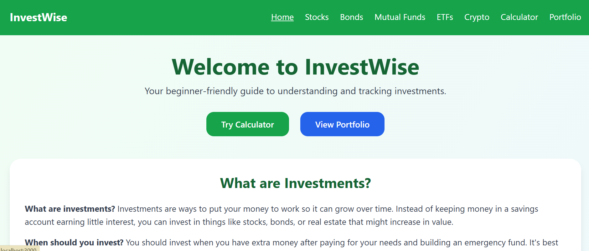
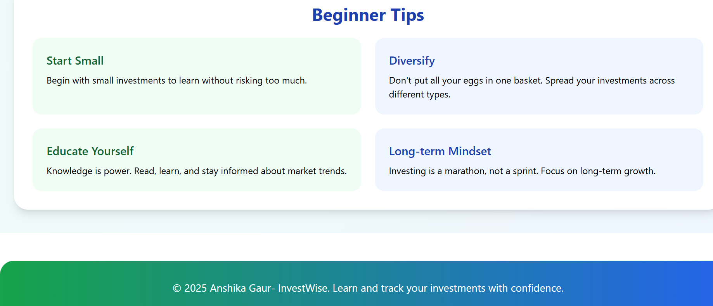
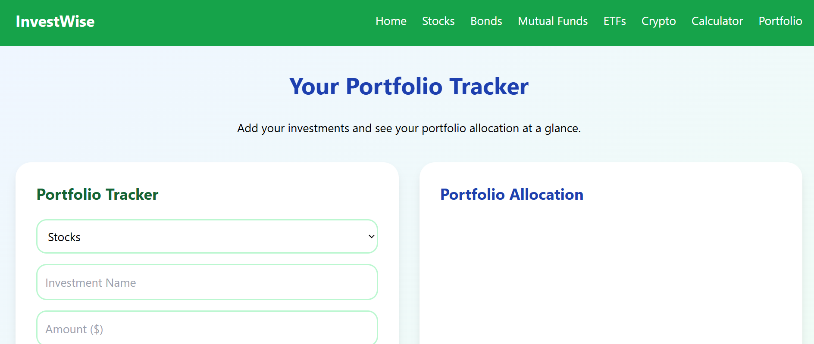
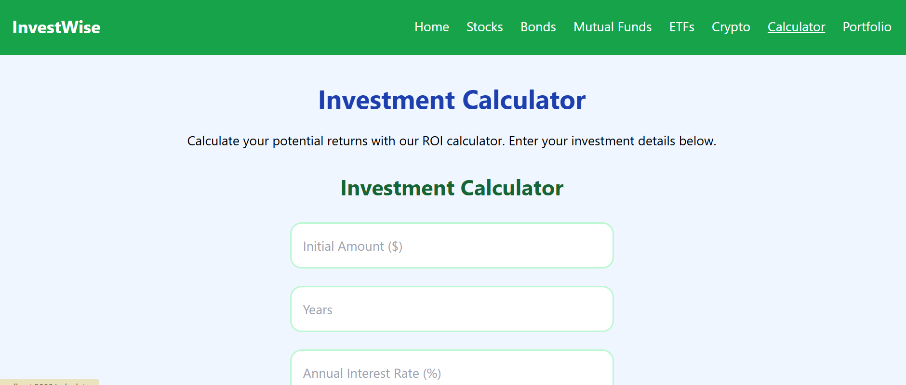
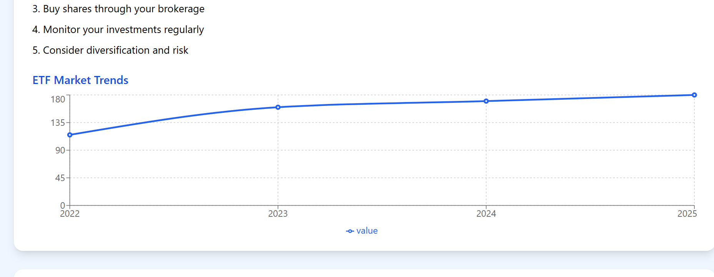

# InvestWise

A beginner-friendly ReactJS application for learning about investments and tracking your portfolio. Built with React Router, Tailwind CSS, and Recharts for a clean, responsive UI with green/blue theme.

## Features

- **Home Overview**: Welcome message, links to investment types, and beginner tips.
- **Detailed Investment Pages**: Separate pages for Stocks, Bonds, Mutual Funds, ETFs, and Crypto with beginner info, pros/cons, how-to-start, trends charts, and FAQs.
- **Portfolio Tracker**: Add, view, and remove investments with LocalStorage persistence. Displays total invested amount and pie chart allocation.
- **Investment Calculator**: Calculate projected returns based on initial amount, years, and interest rate.
- **Responsive Design**: Clean, mobile-friendly UI using Tailwind CSS with green/blue colors, larger fonts, and rounded shapes.

## Technologies Used

- **ReactJS**: Frontend framework for building the UI.
- **React Router Dom**: For multi-page navigation.
- **Tailwind CSS**: Utility-first CSS framework for styling.
- **Recharts**: Chart library for line and pie charts.
- **LocalStorage**: For persisting portfolio data in the browser.

## Author / Contributors

Made by Anshika Gaur

## Pages & Functionality

### Home Page (/)

- Hero section with welcome message.
- Links to each investment type page.
- Beginner tips cards.

### Stocks Page (/stocks)

- Detailed beginner information.
- Pros and cons.
- How to start investing.
- Past trends line chart.
- FAQs accordion.

### Bonds Page (/bonds)

- Detailed beginner information.
- Pros and cons.
- How to start investing.
- Past trends line chart.
- FAQs accordion.

### Mutual Funds Page (/mutual-funds)

- Detailed beginner information.
- Pros and cons.
- How to start investing.
- Past trends line chart.
- FAQs accordion.

### ETFs Page (/etfs)

- Detailed beginner information.
- Pros and cons.
- How to start investing.
- Past trends line chart.
- FAQs accordion.

### Crypto Page (/crypto)

- Detailed beginner information.
- Pros and cons.
- How to start investing.
- Past trends line chart.
- FAQs accordion.

### Calculator Page (/calculator)

- ROI calculator with inputs for amount, years, and interest rate.
- Displays projected returns.

### Portfolio Page (/portfolio)

- Portfolio tracker form to add investments.
- Pie chart for portfolio allocation.
- List of investments with remove option.
- Total invested amount display.

## How to Run the Project Locally

1. **Clone the repository** (if applicable) or navigate to the project directory.

2. **Install dependencies**:
   ```
   npm install
   ```

3. **Start the development server**:
   ```
   npm start
   ```

4. **Open your browser** and go to `http://localhost:3000` to view the app.

## How to Use Portfolio Tracker

1. Navigate to the Portfolio page.
2. Select investment type from the dropdown.
3. Enter the investment name and amount.
4. Click "Add Investment" to add it to your portfolio.
5. View the list of investments and total invested amount.
6. The portfolio allocation pie chart updates automatically.
7. Investments are saved in your browser's LocalStorage.

## How to Use Investment Calculator

1. Go to the Calculator page.
2. Enter the initial investment amount.
3. Enter the number of years.
4. Enter the annual interest rate (as a percentage).
5. Click "Calculate Returns" to see the projected returns.

## Screenshots







## Copyright

© 2025 Anshika Gaur. All rights reserved.

## License Restriction

This software is provided under a restrictive license that prohibits unauthorized copying, distribution, or use of the source code or compiled application. You may not clone, fork, copy, or redistribute this project without explicit permission from the author. All rights are reserved.

If you wish to use or modify this project, please contact the author for licensing terms.


## Contact

For questions or feedback, please reach out.
